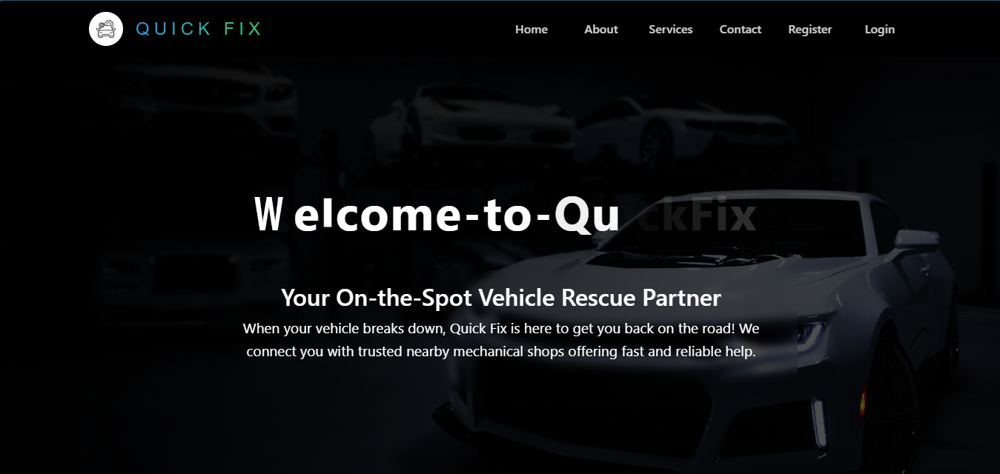
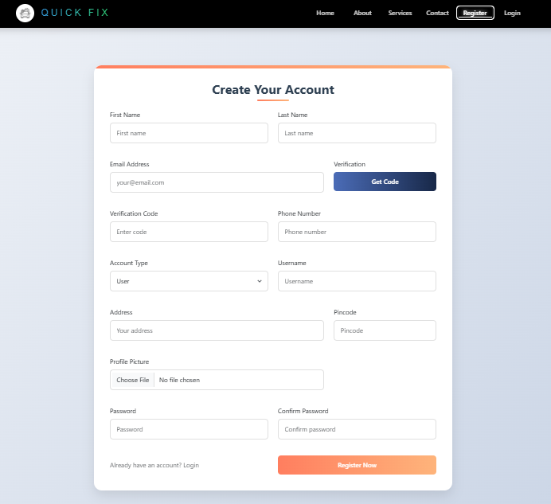
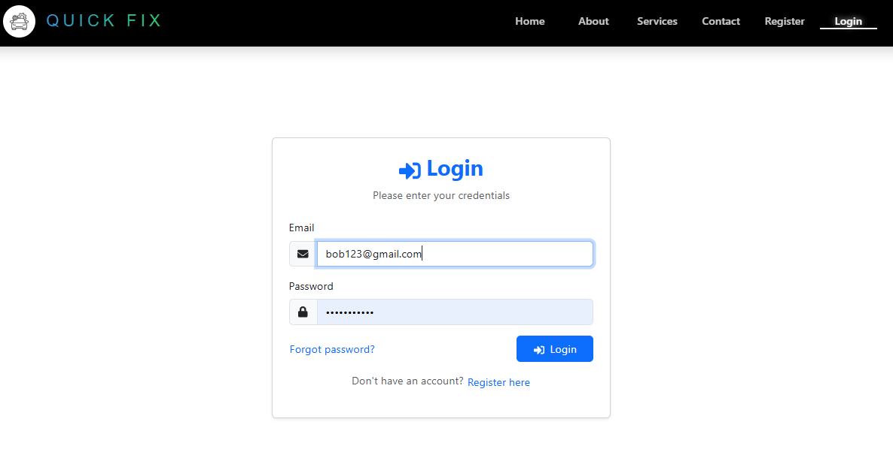
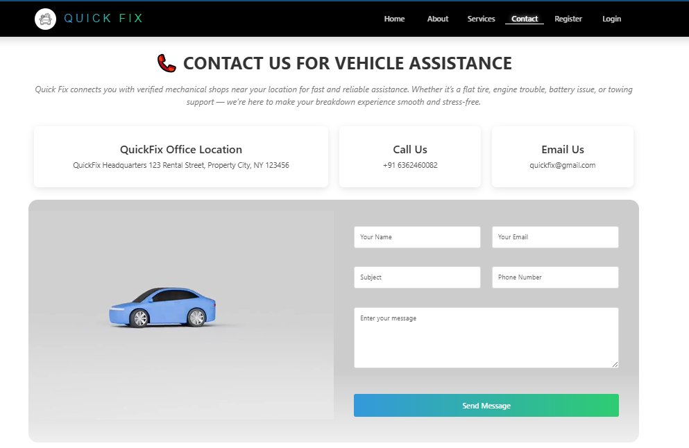
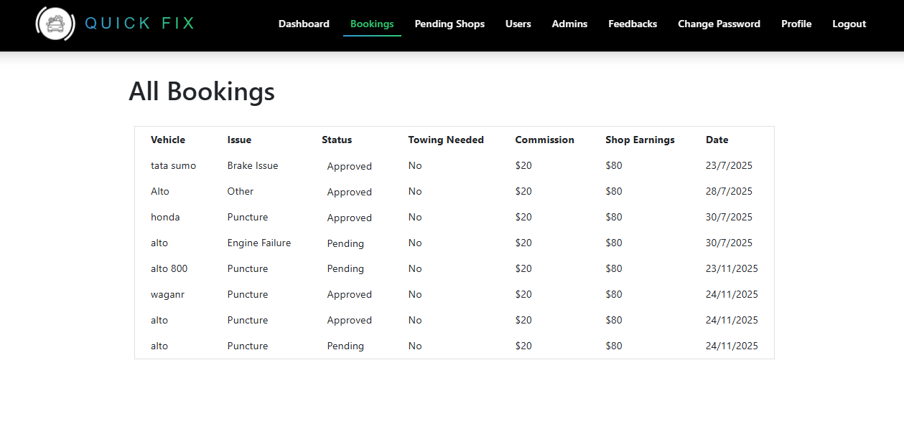
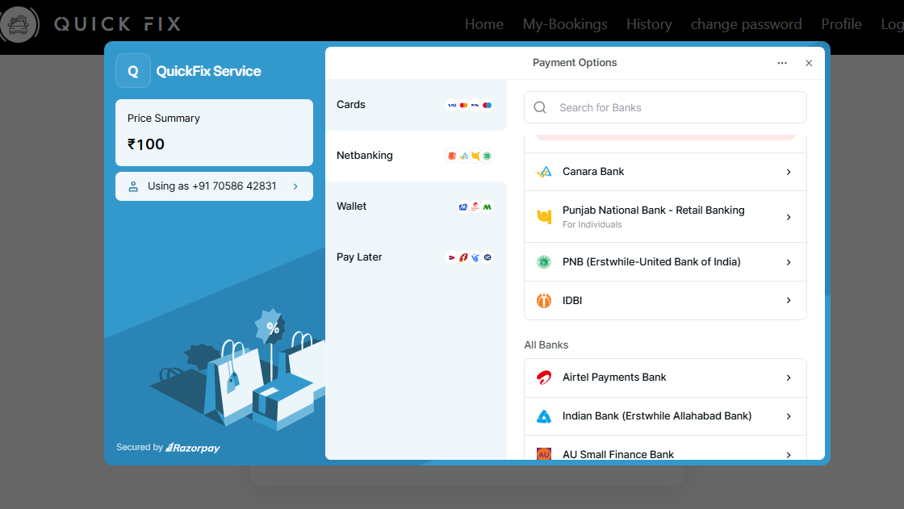
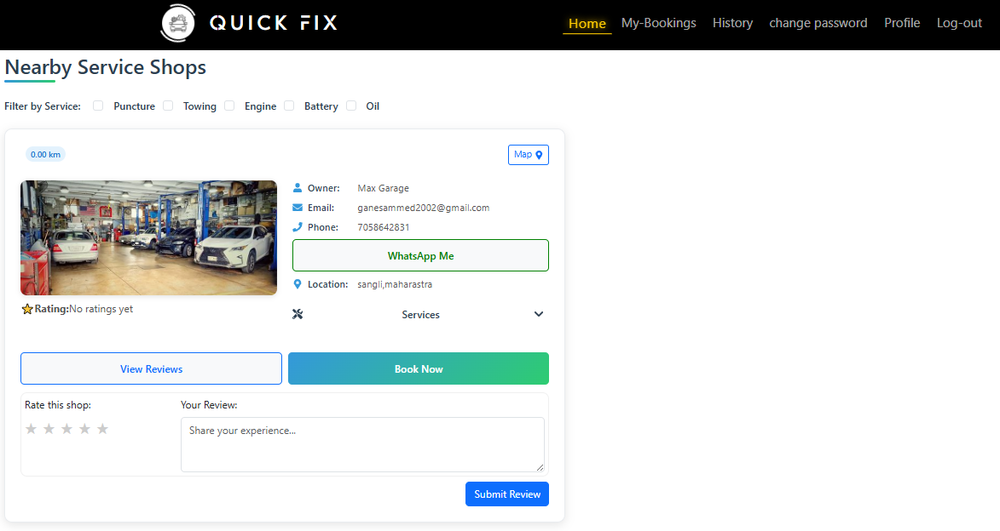
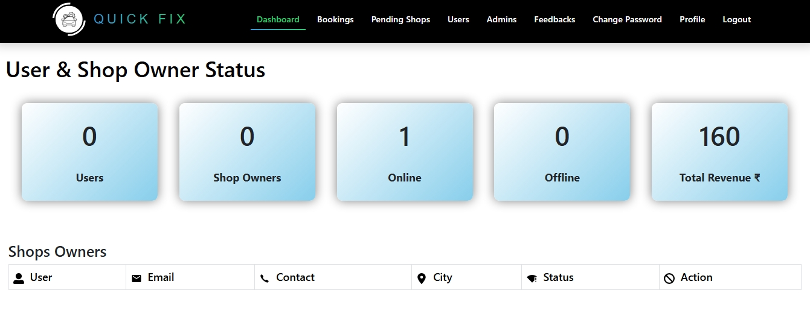

# 🚗 QuickFix Auto

A full-stack roadside vehicle assistance platform built with the MERN stack.

QuickFix Auto is designed to help users request roadside vehicle assistance and connect with available automotive service providers. The application includes user authentication, service management, booking functionality, notifications, and administrative features.

## 📌 Overview

When a vehicle breaks down or requires roadside assistance, finding the right service quickly can be difficult.

QuickFix Auto provides a centralized platform where users can explore available vehicle assistance services and manage their service requests through a web application.

The project follows a client-server architecture with a React frontend and Node.js/Express backend connected to MongoDB.

## ✨ Features

### 👤 User Features

* User registration and login
* Secure authentication using JWT
* User account management
* Browse available vehicle assistance services
* Request/book vehicle assistance
* Manage booking-related information
* Receive notifications
* Contact/support functionality

### 🛠️ Service Management

* Manage roadside assistance services
* Service information and details
* Service-related image/file handling
* Booking management
* Service provider/shop-related functionality

### 🔐 Authentication & Security

* JWT-based authentication
* Password hashing using bcrypt
* Protected API routes
* Role-based access control
* Environment variables for sensitive configuration

### 👨‍💼 Admin Features

* Administrative dashboard functionality
* User management
* Service management
* Booking management
* Notification management
* Contact/request management

### 📍 Location & Assistance

The frontend includes map/location functionality using Leaflet and React-Leaflet, which can be used to support location-based roadside assistance features.

## 🧰 Tech Stack

### Frontend

* React.js
* React Router
* Axios
* Bootstrap
* React-Bootstrap
* Leaflet
* React-Leaflet
* JavaScript
* HTML5
* CSS3

### Backend

* Node.js
* Express.js
* MongoDB
* Mongoose
* JWT
* bcrypt
* Multer
* Nodemailer
* node-cron
* CORS
* dotenv

### Development Tools

* Git
* GitHub
* VS Code
* Postman

## 🏗️ Project Structure

```text
quickfix_auto/
│
├── client/
│   ├── public/
│   └── src/
│       ├── components/
│       ├── context/
│       ├── App.js
│       └── ...
│
├── server/
│   ├── config/
│   ├── controller/
│   ├── middleware/
│   ├── models/
│   ├── routes/
│   ├── uploads/
│   ├── bookingScheduler.js
│   └── index.js
│
└── README.md
```

## 🔄 Application Architecture

```text
User
  │
  ▼
React.js Frontend
  │
  │ Axios / HTTP Requests
  ▼
Express.js REST API
  │
  ├── Authentication & Authorization
  ├── User Management
  ├── Booking Management
  ├── Service Management
  ├── Notifications
  └── Contact Management
  │
  ▼
MongoDB Database
```

## 🚀 Getting Started

### Prerequisites

Make sure you have installed:

* Node.js
* npm
* MongoDB / MongoDB Atlas
* Git

### 1. Clone the repository

```bash
git clone https://github.com/sammed1202/quickfix_auto.git
```

```bash
cd quickfix_auto
```

### 2. Setup the Backend

```bash
cd server
npm install
```

Create a `.env` file inside the `server` directory and add the required environment variables used by the application.

Example:

```env
PORT=5000
MONGO_URI=your_mongodb_connection_string
JWT_SECRET=your_jwt_secret
```

Add any other environment variables required by your configuration, such as email credentials.

Start the backend:

```bash
npm start
```

### 3. Setup the Frontend

Open another terminal:

```bash
cd client
npm install
```

Start the React application:

```bash
npm start
```

The frontend will run on the local development server.

## 🔒 Environment Variables

Do not commit sensitive credentials to GitHub.

The following types of values should be stored in environment variables:

* MongoDB connection string
* JWT secret
* Email credentials
* API keys
* Other private configuration values

## 📂 Backend Architecture

The backend is organized into separate layers:

```text
server/
├── config/
├── controller/
├── middleware/
├── models/
├── routes/
├── uploads/
├── bookingScheduler.js
└── index.js
```

### Controllers

Controllers handle application logic for areas such as:

* Users
* Admin
* Contacts
* Shop services

### Models

MongoDB/Mongoose models include areas such as:

* Users
* Bookings
* Notifications
* Shop services
* Contacts
* Spam users

### Routes

API routes are separated from controller logic to keep the backend organized and maintainable.

## 🎯 Project Goals

QuickFix Auto was developed to demonstrate how a real-world service platform can be built using the MERN stack.

The project focuses on:

* Full-stack web development
* REST API development
* Authentication and authorization
* Database integration
* CRUD operations
* Booking workflows
* File handling
* Notifications
* Admin management
* Location-based functionality
* Responsive frontend development

## 📸 Screenshots

Screenshots of project.....

>## 📸 Screenshots

### Home Page



### Register



### Login



### Login



### Booking



### Payment Getway



### User Dashboard



### Admin Dashboard



## 🌐 Live Demo

**Live Demo:** Add your deployed frontend URL here.

## 👨‍💻 Developer

**Sammed**

MERN Stack Developer

* GitHub: https://github.com/sammed1202
* Email: sammedgane1008@gmail.com

## 📄 License

This project is intended for educational and portfolio purposes.
